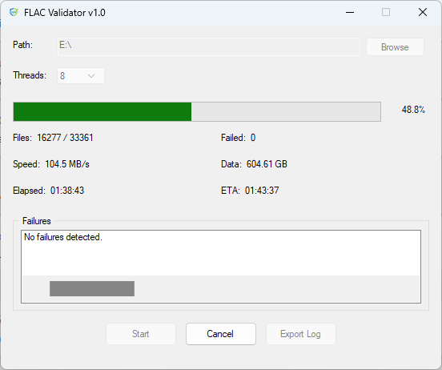
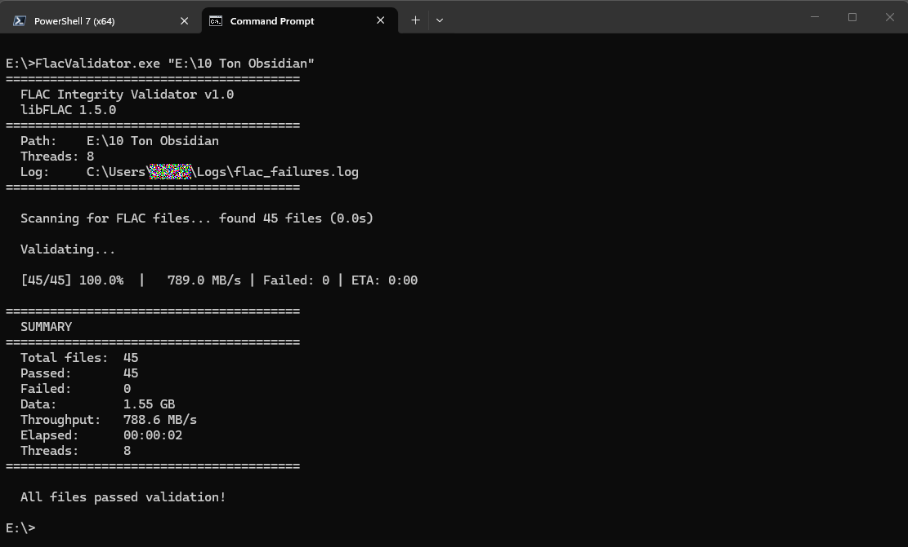
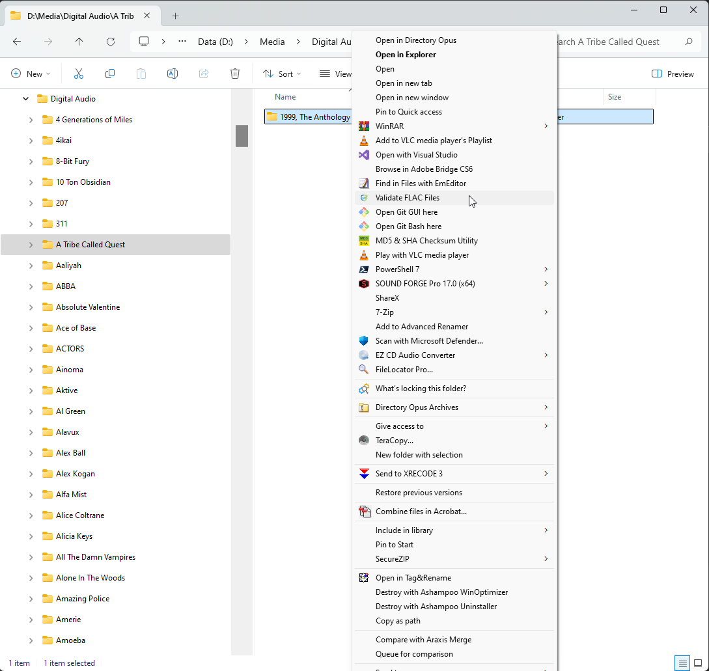

# FLAC Validator

A high-performance, multi-threaded FLAC integrity validator for Windows. Validates FLAC audio files by performing full decode with MD5 checksum verification using [libFLAC](https://github.com/xiph/flac).

Available in two editions:
- **FlacValidator** — Command-line interface (CLI)
- **FlacValidatorGUI** — Graphical interface with Windows Explorer integration

## Screenshots

### GUI Edition


### CLI Edition


### Windows Explorer Context Menu


---

## Features

### Both Editions
- Full FLAC stream decode with MD5 checksum verification
- Multi-threaded validation (configurable thread count)
- Recursive directory scanning
- Detailed failure reporting with error reasons
- Shared INI configuration between editions
- 1 MB read buffer per file for reduced syscall overhead
- Stream-based decoding (`init_stream`) for thread-safe file I/O
- libFLAC 1.5.0 with full Unicode path support

### GUI Edition
- Real-time progress with speed, ETA, and data processed
- Windows taskbar progress bar integration (green/red/yellow states)
- Windows Explorer context menu integration (right-click folders/drives)
- Export validation results to text file
- Copy failures to clipboard (Ctrl+C or right-click context menu)
- Persistent settings (last path, thread count) via INI file
- Auto-start validation when launched from context menu
- Cancel with confirmation dialog
- Tab-navigable interface

### CLI Edition
- Live console progress (updated every 2 seconds)
- Automatic failure log written to `%USERPROFILE%\Logs\flac_failures.log`
- Files sorted for sequential disk access patterns
- Reads shared INI for default path and thread count (never writes INI)
- Custom command-line tokenizer that correctly handles Windows paths (e.g., `E:\`)
- Exit code: `0` = all passed, `1` = failures detected
- Suitable for scripting and automation

---

## Requirements

### Build Environment
- **Visual Studio 2022** (v143 platform toolset)
- **Windows SDK 10.0** or later
- **C++17** standard (`/std:c++17`)
- **vcpkg** package manager
- **Platform:** x64

### Dependencies
| Library | Version | Installed via |
|---------|---------|---------------|
| libFLAC | 1.5.0+  | vcpkg        |
| libogg  | *(pulled automatically by libFLAC)* | vcpkg |

### Runtime DLLs
The following DLLs are produced in the build output directory and must accompany the executables:
- `FLAC.dll`
- `ogg.dll`

---

## Build Instructions

### 1. Install vcpkg

If you don't already have vcpkg installed:

```bash
git clone https://github.com/microsoft/vcpkg.git
cd vcpkg
.\bootstrap-vcpkg.bat
```

### 2. Install libFLAC

```bash
.\vcpkg install libflac:x64-windows
```

This also installs libogg as a transitive dependency.

### 3. Integrate vcpkg with Visual Studio

```bash
.\vcpkg integrate install
```

This enables automatic header and library resolution for all Visual Studio projects on the system.

### 4. Clone This Repository

```bash
git clone https://github.com/WhatImListnTo/FlacValidator.git
cd FlacValidator
```

### 5. Open and Build

1. Open `FlacValidator.sln` in Visual Studio 2022
2. Set configuration to **Release | x64**
3. Build Solution (`Ctrl+Shift+B`)

Output binaries:

- `x64\Release\FlacValidator.exe`
- `x64\Release\FlacValidatorGUI.exe`
- `x64\Release\FLAC.dll`
- `x64\Release\ogg.dll`

---

## Installation

### Basic Installation

Copy the contents of `x64\Release\` to your desired install location, e.g.:

```
C:\Utilities\FlacValidator\
├── FlacValidator.exe
├── FlacValidatorGUI.exe
├── FLAC.dll
└── ogg.dll
```

### Windows Explorer Context Menu (Optional)

To add "Validate FLAC Files" to the right-click menu for folders and drives, create and import the following registry file (adjust paths to your install location):

**FlacValidator_ContextMenu.reg**

```reg
Windows Registry Editor Version 5.00

; Right-click on folders
[HKEY_CURRENT_USER\Software\Classes\Directory\shell\FlacValidator]
@="Validate FLAC Files"
"Icon"="C:\\Utilities\\FlacValidator\\FlacValidatorGUI.exe"

[HKEY_CURRENT_USER\Software\Classes\Directory\shell\FlacValidator\command]
@="\"C:\\Utilities\\FlacValidator\\FlacValidatorGUI.exe\" \"%V\""

; Right-click on drive roots
[HKEY_CURRENT_USER\Software\Classes\Drive\shell\FlacValidator]
@="Validate FLAC Files"
"Icon"="C:\\Utilities\\FlacValidator\\FlacValidatorGUI.exe"

[HKEY_CURRENT_USER\Software\Classes\Drive\shell\FlacValidator\command]
@="\"C:\\Utilities\\FlacValidator\\FlacValidatorGUI.exe\" %V"
```

> **Note:** The Drive entry uses unquoted `%V` because drive roots (e.g., `E:\`) never contain spaces, and quoting causes the trailing backslash to be interpreted as an escape character.

To remove the context menu entries:

```reg
Windows Registry Editor Version 5.00

[-HKEY_CURRENT_USER\Software\Classes\Directory\shell\FlacValidator]
[-HKEY_CURRENT_USER\Software\Classes\Drive\shell\FlacValidator]
```

---

## Usage

### GUI Edition

```
FlacValidatorGUI.exe [path]
```

| Argument | Description |
|----------|-------------|
| `path` | Directory to validate. If provided, validation starts automatically. |

- Launch with no arguments to use the interactive interface
- Launch with a path argument (e.g., from the Explorer context menu) to auto-start validation
- Thread count: 1, 2, 4, 8, 16, or 32 (selectable via dropdown, persisted to INI)

### CLI Edition

```
FlacValidator.exe [path] [--threads N] [--log file.log]
```

| Argument | Description | Default |
|----------|-------------|---------|
| `path` | Directory to scan recursively | INI LastPath, then current directory |
| `--threads N` or `-t N` | Number of validation threads | INI Threads, then CPU core count |
| `--log path` or `-l path` | Failure log output path | `%USERPROFILE%\Logs\flac_failures.log` |
| `--help` or `-h` | Show usage help | |

Examples:

```bash
# Validate a specific path with 16 threads
FlacValidator.exe "E:\Music" --threads 16

# Use INI settings (path and threads from last GUI session)
FlacValidator.exe

# Validate with custom log location
FlacValidator.exe "D:\Media\Digital Audio" -t 8 -l "D:\flac_results.log"
```

---

## Shared INI File

Both editions share `FlacValidator.ini`, located alongside the executables:

```ini
[Settings]
LastPath=E:\
Threads=8
```

- **GUI** reads and writes the INI (persists path and thread selections)
- **CLI** reads the INI for defaults but never writes to it

This allows the GUI to configure settings that the CLI inherits, enabling zero-argument CLI execution after initial GUI setup.

---

## Project Structure

```
FlacValidator.sln
├── FlacValidator/                  # CLI project
│   └── FlacValidator.cpp
├── FlacValidatorGUI/               # GUI project
│   ├── FlacValidatorGUI.cpp
│   ├── FlacValidatorGUI.h
│   ├── FlacValidatorGUI.ico
│   ├── FlacValidatorGUI.rc
│   ├── Resource.h
│   ├── framework.h
│   └── targetver.h
├── screenshots/
│   ├── gui_main.png
│   ├── cli_main.png
│   └── context_menu.png
└── README.md
```

---

## Technical Details

### Validation Method

Each FLAC file undergoes:

1. **Full stream decode** (all audio frames processed through libFLAC)
2. **Frame CRC verification** (performed automatically during decode)
3. **MD5 checksum verification** (computed hash compared against stored hash in STREAMINFO)

A file fails validation if:
- It cannot be opened or read
- The FLAC stream contains decode errors (frame CRC failures, corrupt data)
- The computed MD5 does not match the stored MD5 checksum

### Architecture

- **Stream callbacks** (`FLAC__stream_decoder_init_stream`) — each thread owns its own `FILE*` with no lifecycle ambiguity; `finish()` never touches the file handle
- **1 MB read buffer** per file (`setvbuf` with `_IOFBF`) for reduced syscall overhead
- **Atomic counters** for lock-free progress tracking across threads
- **Mutex-protected failure list** (only contended on failures, which are rare)
- **UI thread isolation** — worker threads communicate via `PostMessage`; no direct UI access from workers
- **Custom command-line tokenizer** (CLI) — bypasses MSVC CRT's `argv` parser which misinterprets `\"` in paths like `"E:\"`

### Performance

Typical throughput depends on storage:

- **Network storage** (WebDAV/NAS): 100–200 MB/s (I/O bound)
- **Local SSD / cached**: 1000+ MB/s (CPU decode bound)

### Taskbar Progress States

| State | Color | Meaning |
|-------|-------|---------|
| `TBPF_NORMAL` | Green | Validation in progress, no failures |
| `TBPF_ERROR` | Red | Failures detected (shown during and after validation) |
| `TBPF_PAUSED` | Yellow | Validation was cancelled by user |
| `TBPF_NOPROGRESS` | None | Validation complete with no failures |

---

## License

This project is released into the public domain. You are free to use, modify, and distribute it without restriction.

See [UNLICENSE](UNLICENSE) for details.

## Acknowledgments

- [libFLAC](https://github.com/xiph/flac) — Xiph.Org Foundation
- [vcpkg](https://github.com/microsoft/vcpkg) — Microsoft C/C++ package manager
